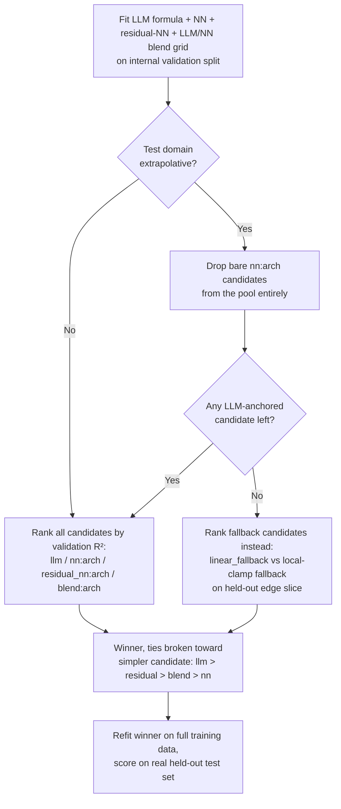
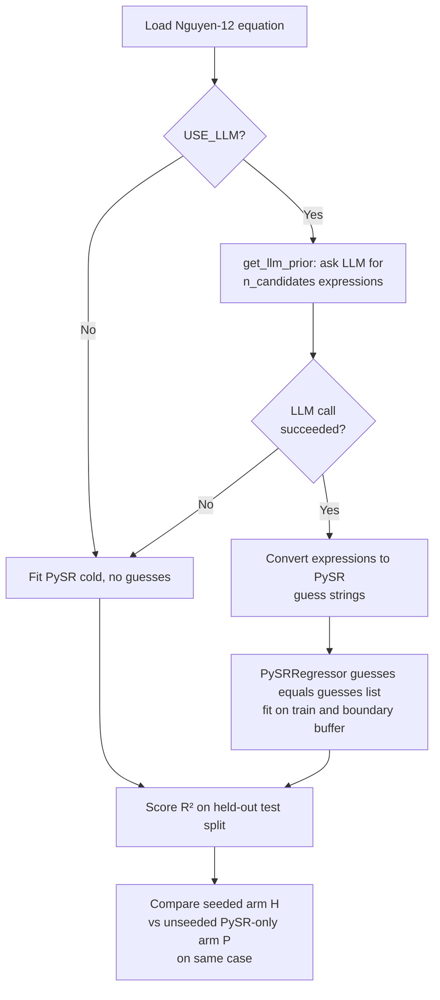

# HypatiaX Hybrid Method Variants 6, 6-PCA, 7 — Verified Source Mapping & Algorithms

**Repo:** `github.com/sednabcn/LLM-HypatiaX-REPRO` — freshly cloned and grepped
this session (2026-09-22). `hybrid_variants_catalog.py` (attached) re-runs this
check programmatically: `python hybrid_variants_catalog.py /path/to/repo`.

The three uploaded scripts (`hypatiax_defi_benchmark_v4.py`,
`exp3_nguyen12_consolidated.py`, `run_hybrid_system_benchmark.py`) are
**byte-identical** to the real repo copies (`diff` = 0 lines on all three) —
nothing in them was altered or invented.

These extend, not replace, the original 5-variant table
(`hypatiax_variants_source_mapping_report.md`), which also re-verified clean.

---

## Variant 6 — Validation-Selected Residual Hybrid

| | |
|---|---|
| Source | `hypatiax/experiments/benchmarks/hypatiax_defi_benchmark_v4.py` |
| Symbols | `_select_v4_candidate()`, `_v4_hybrid_predict_and_eval()` |
| Strategy | Pick the best of 5 candidate arms on a held-out internal validation slice |
| Invoked by | itself (the v4 benchmark's own run loop) |

The file's own header states it **replaces** the real sources behind
Variants 1–3 ("Replaces all previous versions: ... `hybrid_system_nn_defi_
domain.py`, `hybrid_ensemble_system_defi_domain.py`, ..."). It also still
contains the older Fix‑1‑through‑13 gate cascade (`_hybrid_predict_and_eval` +
`_ensemble_llm_nn`) — structurally similar to Variants 1 and 3 — but that
function is **dead code**: the call site's own comment calls it "old (dead)";
only `_v4_hybrid_predict_and_eval` is ever invoked in the run loop.

---

## Variant 6-PCA — Same Selector, PCA-Projected Features

| | |
|---|---|
| Source | `hypatiax/experiments/benchmarks/hypatiax_defi_benchmark_v4_pca.py` |
| Symbol | `_select_v4_candidate()` (identical logic to Variant 6) |
| Strategy | Variant 6's selector, run on PCA-projected input features |
| Invoked by | `test_defi_benchmark_v4_smoke.py`, `baseline_pure_llm_defi_discovery.py` |

A sibling file, not a fork with different logic — the gate/candidate-pool code
is the same. Confirmed the same historical bug ("Fix 15") was patched in both
copies verbatim, per `hypatiax_defi_benchmark_v4.py`'s own changelog note:
*"Same bug present verbatim in the `_pca` variant of this function."* The
flowchart above applies unchanged; only the feature space feeding it differs.

---

## Variant 7 — LLM-Prior PySR Population Seeding

| | |
|---|---|
| Source | `hypatiax/experiments/benchmarks/exp3_nguyen12_consolidated.py` + `hypatia.py` |
| Symbol | `get_llm_prior()` (in `hypatia.py`) |
| Strategy | LLM candidate expressions seeded as initial population members of a genetic search |
| Invoked by | itself (Exp 3, Nguyen-12 suite) |

This is mechanically different from Variants 1–6: there is no R² threshold
gate and no post-hoc blend. `get_llm_prior()` asks the LLM for
`n_candidates` expressions per equation; they're converted to PySR guess
strings and passed straight into `PySRRegressor(guesses=...)` **at
construction time** — the search itself starts from LLM-proposed points
rather than choosing between finished LLM/NN outputs afterward.

Two guard behaviors worth flagging, both verified in source:
- **Fail-fast, not silent degrade:** if the installed `pysr` build has no
  `guesses` parameter at all, the run refuses to start rather than quietly
  falling back to an unseeded run (`FIX-LLM-WARMSTART-CTOR`).
- **`ENGINE=hybrid_system_v50_2` is vestigial here.** It's set via
  `os.environ.setdefault` at import time, but the actual LLM-arm (`H`) fit
  path uses a raw `PySRRegressor`, not `HybridDiscoverySystem` — so despite
  the env var name, this script does not route through Variant 5's real
  class at all.

---

## Consolidated table (all 8 variants)

| # | Name | Strategy family | Real symbol |
|---|---|---|---|
| 1 | Enhanced Hybrid DeFi | R²-threshold gate | `EnhancedHybridSystemDeFi` |
| 2 | Hybrid All-Domains | LLM-first gate | `HybridSystemAllDomains` |
| 3 | Ensemble Example | Inverse-uncertainty weighted blend | `ensemble_llm_nn()` |
| 4 | LLM-Prior / PySR Family | Mode-dependent dispatch | `SymbolicEngineWithLLM` |
| 5 | Template Physics Fallback | Retry loop + template fallback | `HybridDiscoverySystem` |
| **6** | **Validation-Selected Residual Hybrid** | **Validation-scored candidate pool** | `_select_v4_candidate()` |
| **6-PCA** | **… (PCA features)** | **same, PCA-projected inputs** | `_select_v4_candidate()` |
| **7** | **LLM-Prior PySR Population Seeding** | **Genetic-search population seeding** | `get_llm_prior()` |

Run `hybrid_variants_catalog.py` with no arguments to print this table from
code, or with a repo path to re-verify every row against real source.
